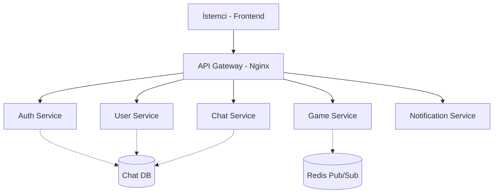

# FT_PINPON Backend Documentation

## 📋 İçindekiler

- [Genel Bakış](#-genel-bakış)
- [Microservices Mimarisi](#-microservices-mimarisi)
- [Teknoloji Yığını](#-teknoloji-yığını)
- [Servisler Detayı](#-servisler-detayı)
- [Veritabanı Yapısı](#-veritabanı-yapısı)
- [API Gateway ve Yönlendirme](#-api-gateway-ve-yönlendirme)
- [Kurulum ve Çalıştırma](#-kurulum-ve-çalıştırma)

---

## 🎯 Genel Bakış

**FT_PINPON Backend**, yüksek ölçeklenebilirlik ve modülerlik sağlamak amacıyla **Microservices** mimarisi ile tasarlanmıştır. Sistem, her biri belirli bir iş alanından (domain) sorumlu olan bağımsız servislerden oluşur. Tüm servisler **Node.js** ve **Fastify** altyapısı üzerinde çalışır ve **API Gateway** arkasında konumlandırılmıştır.

---

## 🧩 Microservices Mimarisi

Sistem şu temel bileşenlerden oluşur:



Her servis Docker konteynerleri içinde izole bir şekilde çalışır.

---

## 🛠️ Teknoloji Yığını

| Teknoloji                   | Kullanım                                  |
| --------------------------- | ----------------------------------------- |
| **Node.js**                 | Runtime Environment                       |
| **Fastify**                 | Yüksek performanslı Web Framework         |
| **TypeScript**              | Statik tipleme ve güvenli kod geliştirme  |
| **SQLite (Better-SQLite3)** | Hafif ve hızlı ilişkisel veritabanı       |
| **Nginx**                   | Reverse Proxy ve API Gateway              |
| **Docker & Compose**        | Konteynerizasyon ve Orkestrasyon          |
| **WebSocket (ws)**          | Gerçek zamanlı çift yönlü iletişim        |
| **Speakeasy**               | 2FA (Two-Factor Authentication) işlemleri |

---

## 📦 Servisler Detayı

### 1. 🛡️ Auth Service (`auth-service`)

Kimlik doğrulama ve yetkilendirme işlemlerini yürütür.

- **Port**: Dahili ağda çalışır.
- **Özellikler**:
  - Kullanıcı Kaydı (Sign Up)
  - Kullanıcı Girişi (Sign In)
  - JWT (JSON Web Token) üretimi ve doğrulama.
  - Google OAuth Entegrasyonu.
  - 2FA (QR Kod üretimi ve doğrulama).

### 2. 👤 User Service (`user-service`)

Kullanıcı profilleri ve sosyal ilişkileri yönetir.

- **Özellikler**:
  - Profil görüntüleme ve düzenleme (Avatar, Bio).
  - Arkadaşlık isteği gönderme/kabul etme.
  - Kullanıcı engelleme.
  - İstatistik takibi (Maç sayısı, galibiyet oranı).

### 3. 🎮 Game Service (`game-service`)

Oyun mantığını ve odalarını yönetir.

- **Özellikler**:
  - **Matchmaking**: Oyuncuları eşleştirme.
  - **Oyun Motoru**: Server-side fizik hesaplamaları.
  - **WebSocket**: 60 FPS top/raket pozisyon senkronizasyonu.
  - **Turnuva Modu**: 4 veya 8 kişilik turnuva ağacı oluşturma.

### 4. 💬 Chat Service (`chat-service`)

Anlık mesajlaşma altyapısını sağlar.

- **Özellikler**:
  - DM (Direct Message) gönderme.
  - Geçmiş mesajları veritabanında saklama.
  - Online/Offline durum takibi.
  - Engelli kullanıcılardan gelen mesajları filtreleme.

### 5. 🔔 Notification Service (`notification-service`)

Kullanıcılara gerçek zamanlı bildirimler gönderir.

- **Kullanım Alanları**:
  - Yeni arkadaş isteği.
  - Oyun daveti.
  - Turnuva başlangıcı.

---

## 🗄️ Veritabanı Yapısı

Her mikroservis kendi **SQLite** veritabanına sahiptir (Database-per-Service Pattern). Bu sayede servisler arası bağ (coupling) en aza indirilir.

- **Migration**: Veritabanı şema değişiklikleri `migration` scriptleri ile yönetilir.
- **ORM**: Performans için raw SQL veya hafif query builder'lar (Kysely vb.) tercih edilmiştir.

---

## 🚪 API Gateway ve Yönlendirme

**Nginx**, tüm trafiği karşılayan tek giriş noktasıdır. İstekleri URL path'ine göre ilgili servise yönlendirir.

| URL Path      | Hedef Servis                    |
| ------------- | ------------------------------- |
| `/api/auth/*` | `auth-service:3001`             |
| `/api/user/*` | `user-service:3002`             |
| `/api/game/*` | `game-service:3003`             |
| `/chat/*`     | `chat-service:3004` (WebSocket) |
| `/ws/*`       | `game-service:3003` (WebSocket) |

---

## 🚀 Kurulum ve Çalıştırma

Tüm sistemi ayağa kaldırmak için Docker Compose kullanılır.

1. **Repoyu Klonlayın**

   ```bash
   git clone <repo-url>
   cd Backend
   ```

2. **Ortam Değişkenlerini Hazırlayın**
   Her servis klasörü içindeki `.env.example` dosyalarını `.env` olarak kopyalayın.

3. **Docker ile Başlatın**

   ```bash
   docker-compose up --build
   ```

   Bu komut tüm servisleri derler, veritabanlarını oluşturur ve Nginx'i başlatır.

4. **Kontrol Edin**
   Sistem `http://localhost:3000` (veya Nginx portu) üzerinden erişilebilir olmalıdır.
